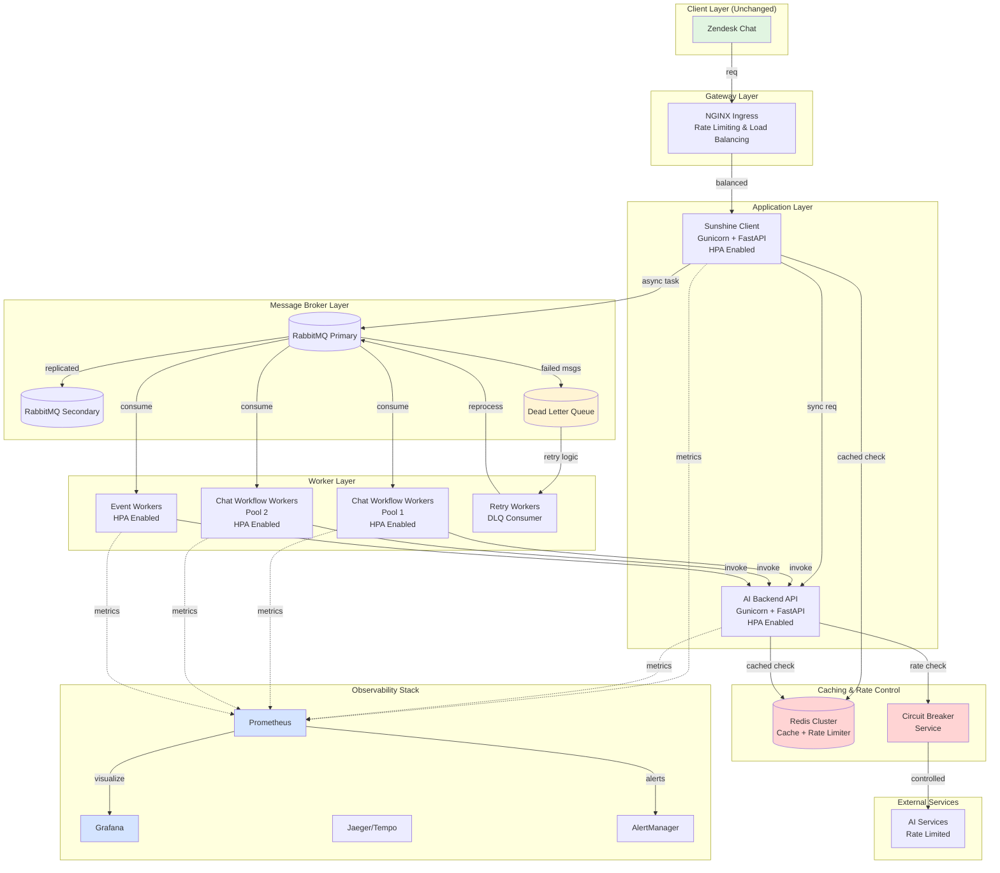

# Architecture Redesign: Resilient AI Backend System

## Summary

The proposed architecture addresses critical bottlenecks in the current system by introducing resilience patterns, proper observability, and scalable components while maintaining backward compatibility with existing client infrastructure.

## Current Architecture Analysis

### Identified Chokes

1. **Rate Limiting Issues (429 errors)**
   - Direct calls to AI Services without throttling
   - No circuit breaker or retry logic
   - Lack of request queuing and batching

2. **Observability Gaps**
   - In-house Celery monitoring insufficient
   - No distributed tracing
   - Limited metrics collection

3. **Reliability Concerns**
   - No Dead Letter Queue (DLQ) implementation
   - Single point of failure with RabbitMQ
   - Missing health checks and failover mechanisms

4. **Performance Bottlenecks**
   - Sunshine Client acting as chokepoint
   - Inefficient execution logic
   - No caching layer

## Proposed Architecture

### Visual Flow Diagram



## Component Design Details

### 1. Gateway Layer Enhancement

**Component**: NGINX Ingress Controller

**Purpose**: Request distribution, rate limiting, and load balancing

**Configuration**:
```yaml
apiVersion: networking.k8s.io/v1
kind: Ingress
metadata:
  annotations:
    nginx.ingress.kubernetes.io/rate-limit: "100"
    nginx.ingress.kubernetes.io/limit-rps: "20"
    nginx.ingress.kubernetes.io/proxy-body-size: "10m"
    nginx.ingress.kubernetes.io/proxy-connect-timeout: "30"
    nginx.ingress.kubernetes.io/proxy-send-timeout: "30"
    nginx.ingress.kubernetes.io/proxy-read-timeout: "30"
```

**Benefits**:
- Prevents overwhelming downstream services
- Distributes load evenly
- Provides connection pooling

### 2. Application Layer Optimization

**Changes from Current**:
- Replace Uvicorn with Gunicorn for better worker management
- Implement Horizontal Pod Autoscaler (HPA) based on CPU/Memory
- Add health check endpoints with dependency verification

**Gunicorn Configuration**:
```python
# gunicorn.conf.py
import multiprocessing

bind = "0.0.0.0:8000"
workers = multiprocessing.cpu_count() * 2 + 1
worker_class = "uvicorn.workers.UvicornWorker"
worker_connections = 1000
max_requests = 1000
max_requests_jitter = 50
timeout = 30
keepalive = 2
threads = 4
```

**HPA Configuration**:
```yaml
apiVersion: autoscaling/v2
kind: HorizontalPodAutoscaler
metadata:
  name: ai-backend-hpa
spec:
  scaleTargetRef:
    apiVersion: apps/v1
    kind: Deployment
    name: ai-backend
  minReplicas: 2
  maxReplicas: 10
  metrics:
  - type: Resource
    resource:
      name: cpu
      target:
        type: Utilization
        averageUtilization: 70
  - type: Resource
    resource:
      name: memory
      target:
        type: Utilization
        averageUtilization: 80
```

### 3. Caching & Rate Control Layer

**Component**: Redis Cluster + Circuit Breaker

**Purpose**: 
- Cache frequently accessed data
- Implement distributed rate limiting
- Circuit breaker for external service calls

**Implementation**:
```python
# circuit_breaker.py
from typing import Optional, Callable
import redis
import time
from enum import Enum

class CircuitState(Enum):
    CLOSED = "closed"
    OPEN = "open"
    HALF_OPEN = "half_open"

class CircuitBreaker:
    def __init__(
        self, 
        redis_client: redis.Redis,
        failure_threshold: int = 5,
        recovery_timeout: int = 60,
        expected_exception: type = Exception
    ):
        self.redis_client = redis_client
        self.failure_threshold = failure_threshold
        self.recovery_timeout = recovery_timeout
        self.expected_exception = expected_exception
        self.key_prefix = "circuit_breaker:"
        
    def call(self, func: Callable, *args, **kwargs):
        state = self._get_state(func.__name__)
        
        if state == CircuitState.OPEN:
            if self._should_attempt_reset(func.__name__):
                state = CircuitState.HALF_OPEN
            else:
                raise Exception("Circuit breaker is OPEN")
        
        try:
            result = func(*args, **kwargs)
            self._on_success(func.__name__, state)
            return result
        except self.expected_exception as e:
            self._on_failure(func.__name__, state)
            raise e
```

**Redis Configuration**:
```yaml
apiVersion: v1
kind: ConfigMap
metadata:
  name: redis-config
data:
  redis.conf: |
    maxmemory 2gb
    maxmemory-policy allkeys-lru
    save 900 1
    save 300 10
    appendonly yes
```

### 4. Message Broker Resilience

**Component**: RabbitMQ Cluster with DLQ

**Purpose**: 
- High availability through clustering
- Dead Letter Queue for failed message handling
- Message persistence

**RabbitMQ Configuration**:
```yaml
apiVersion: v1
kind: ConfigMap
metadata:
  name: rabbitmq-config
data:
  rabbitmq.conf: |
    cluster_formation.peer_discovery_backend = kubernetes
    cluster_formation.k8s.host = kubernetes.default.svc.cluster.local
    cluster_formation.k8s.address_type = hostname
    cluster_partition_handling = autoheal
    
    # DLQ Configuration
    queue.master_locator = min-masters
    
    # Performance tuning
    vm_memory_high_watermark.relative = 0.6
    disk_free_limit.absolute = 10GB
```

**DLQ Implementation**:
```python
# dlq_handler.py
import pika
import json
from typing import Dict, Any
import logging

class DLQHandler:
    def __init__(self, connection_params: Dict[str, Any]):
        self.connection = pika.BlockingConnection(
            pika.ConnectionParameters(**connection_params)
        )
        self.channel = self.connection.channel()
        
        # Declare main queue with DLQ settings
        self.channel.queue_declare(
            queue='chat_workflow',
            durable=True,
            arguments={
                'x-dead-letter-exchange': 'dlx',
                'x-dead-letter-routing-key': 'failed_messages',
                'x-message-ttl': 3600000,  # 1 hour
                'x-max-retries': 3
            }
        )
        
        # Declare DLQ
        self.channel.exchange_declare(
            exchange='dlx',
            exchange_type='direct'
        )
        
        self.channel.queue_declare(
            queue='dead_letter_queue',
            durable=True
        )
        
        self.channel.queue_bind(
            exchange='dlx',
            queue='dead_letter_queue',
            routing_key='failed_messages'
        )
    
    def process_dead_letters(self):
        """Process messages from DLQ with retry logic"""
        def callback(ch, method, properties, body):
            retry_count = properties.headers.get('x-retry-count', 0)
            
            if retry_count < 3:
                # Retry with exponential backoff
                delay = 2 ** retry_count * 1000  # milliseconds
                
                ch.basic_publish(
                    exchange='',
                    routing_key='chat_workflow',
                    body=body,
                    properties=pika.BasicProperties(
                        delivery_mode=2,
                        headers={'x-retry-count': retry_count + 1},
                        expiration=str(delay)
                    )
                )
                logging.info(f"Retrying message, attempt {retry_count + 1}")
            else:
                # Log and store permanently failed message
                logging.error(f"Message failed after max retries: {body}")
                self._store_failed_message(body)
            
            ch.basic_ack(delivery_tag=method.delivery_tag)
        
        self.channel.basic_consume(
            queue='dead_letter_queue',
            on_message_callback=callback
        )
        
        self.channel.start_consuming()
```

### 5. Worker Pool Optimization

**Component**: Celery Worker Pools with HPA (Horizontal Pod Autoscaling)

**Purpose**:
- Separate worker pools for different workload types
- Auto-scaling based on queue depth and resource usage
- Improved concurrency handling

**Enhanced Celery Configuration**:
```python
# celery_config.py
from celery import Celery
from kombu import Queue, Exchange
import os

app = Celery('ai_backend')

app.conf.update(
    broker_url=os.getenv('RABBITMQ_URL'),
    result_backend='redis://redis-cluster:6379/0',
    
    # Task execution settings
    task_acks_late=True,
    task_reject_on_worker_lost=True,
    task_time_limit=300,  # 5 minutes
    task_soft_time_limit=240,  # 4 minutes
    
    # Worker settings
    worker_prefetch_multiplier=1,
    worker_max_tasks_per_child=100,
    worker_disable_rate_limits=False,
    
    # Queue configuration
    task_routes={
        'app.tasks.chat.*': {'queue': 'chat_workflow'},
        'app.tasks.events.*': {'queue': 'events'},
        'app.tasks.retry.*': {'queue': 'retry_queue'},
    },
    
    task_queues=(
        Queue('chat_workflow', Exchange('chat'), routing_key='chat.#'),
        Queue('events', Exchange('events'), routing_key='events.#'),
        Queue('retry_queue', Exchange('retry'), routing_key='retry.#'),
    ),
    
    # Retry configuration
    task_autoretry_for=(Exception,),
    task_max_retries=3,
    task_default_retry_delay=60,  # 1 minute
)
```

**Worker Deployment Configuration**:
```yaml
apiVersion: apps/v1
kind: Deployment
metadata:
  name: celery-chat-workers
spec:
  replicas: 2
  template:
    spec:
      containers:
      - name: celery-worker
        image: fraiday.azurecr.io/ai-backend:latest
        command:
        - celery
        - -A
        - app.celery_app
        - worker
        - --loglevel=info
        - -Q
        - chat_workflow
        - --concurrency=4
        - --max-tasks-per-child=100
        - --time-limit=300
        resources:
          requests:
            cpu: 500m
            memory: 1Gi
          limits:
            cpu: 2000m
            memory: 2Gi
        livenessProbe:
          exec:
            command:
            - celery
            - -A
            - app.celery_app
            - inspect
            - ping
          initialDelaySeconds: 30
          periodSeconds: 60
```

### 6. Observability Stack

**Components**: Prometheus + Grafana + Jaeger + AlertManager

**Purpose**:
- Real-time metrics collection and visualization
- Distributed tracing for request flow
- Alerting for critical issues

**Prometheus Configuration**:
```yaml
apiVersion: v1
kind: ConfigMap
metadata:
  name: prometheus-config
data:
  prometheus.yml: |
    global:
      scrape_interval: 15s
      evaluation_interval: 15s
    
    scrape_configs:
    - job_name: 'ai-backend'
      kubernetes_sd_configs:
      - role: pod
        selectors:
        - role: pod
          label: "app=ai-backend"
      relabel_configs:
      - source_labels: [__meta_kubernetes_pod_annotation_prometheus_io_scrape]
        action: keep
        regex: true
      - source_labels: [__meta_kubernetes_pod_annotation_prometheus_io_path]
        action: replace
        target_label: __metrics_path__
        regex: (.+)
    
    - job_name: 'celery-workers'
      static_configs:
      - targets: ['celery-exporter:9540']
    
    alerting:
      alertmanagers:
      - static_configs:
        - targets: ['alertmanager:9093']
    
    rule_files:
    - '/etc/prometheus/rules/*.yml'
```

**Metrics Implementation**:
```python
# metrics.py
from prometheus_client import Counter, Histogram, Gauge
import time
from functools import wraps

# Define metrics
request_count = Counter(
    'http_requests_total',
    'Total HTTP requests',
    ['method', 'endpoint', 'status']
)

request_duration = Histogram(
    'http_request_duration_seconds',
    'HTTP request latency',
    ['method', 'endpoint']
)

active_tasks = Gauge(
    'celery_active_tasks',
    'Number of active Celery tasks',
    ['queue']
)

ai_service_errors = Counter(
    'ai_service_errors_total',
    'Total errors from AI service',
    ['error_type', 'service']
)

def track_request_metrics(func):
    @wraps(func)
    async def wrapper(*args, **kwargs):
        start_time = time.time()
        try:
            response = await func(*args, **kwargs)
            request_count.labels(
                method=request.method,
                endpoint=request.url.path,
                status=response.status_code
            ).inc()
            return response
        finally:
            request_duration.labels(
                method=request.method,
                endpoint=request.url.path
            ).observe(time.time() - start_time)
    return wrapper
```

**Alert Rules**:
```yaml
apiVersion: v1
kind: ConfigMap
metadata:
  name: prometheus-rules
data:
  alerts.yml: |
    groups:
    - name: ai_backend_alerts
      rules:
      - alert: High429ErrorRate
        expr: rate(ai_service_errors_total{error_type="429"}[5m]) > 10
        for: 5m
        labels:
          severity: warning
        annotations:
          summary: "High rate of 429 errors from AI service"
          description: "{{ $value }} 429 errors per second"
      
      - alert: CeleryQueueBacklog
        expr: celery_queue_length{queue="chat_workflow"} > 100
        for: 10m
        labels:
          severity: warning
        annotations:
          summary: "Celery queue backlog detected"
          description: "Queue {{ $labels.queue }} has {{ $value }} pending tasks"
      
      - alert: HighMemoryUsage
        expr: container_memory_usage_bytes / container_spec_memory_limit_bytes > 0.9
        for: 5m
        labels:
          severity: critical
        annotations:
          summary: "Container memory usage above 90%"
          description: "Container {{ $labels.container }} memory usage is {{ $value }}%"
```

## Resource Requirements

### Additional Infrastructure

```yaml
# Resource Summary
components:
  redis_cluster:
    nodes: 3
    memory_per_node: 4Gi
    cpu_per_node: 1
    storage_per_node: 10Gi
  
  rabbitmq_cluster:
    nodes: 2
    memory_per_node: 2Gi
    cpu_per_node: 1
    storage_per_node: 20Gi
  
  observability_stack:
    prometheus:
      memory: 4Gi
      cpu: 2
      storage: 100Gi
    grafana:
      memory: 1Gi
      cpu: 0.5
    jaeger:
      memory: 2Gi
      cpu: 1
      storage: 50Gi
  
  application_scaling:
    min_replicas: 2
    max_replicas: 10
    target_cpu: 70%
    target_memory: 80%
```

## Configuration Management

### Environment Variables Update

```python
# .env.production
# Application
APP_NAME=ai-backend
ENVIRONMENT=production
DEBUG=false
LOG_LEVEL=info

# Gunicorn
GUNICORN_WORKERS=4
GUNICORN_THREADS=4
GUNICORN_TIMEOUT=30
GUNICORN_MAX_REQUESTS=1000

# Redis
REDIS_CLUSTER_NODES=redis-node-1:6379,redis-node-2:6379,redis-node-3:6379
REDIS_PASSWORD=${REDIS_PASSWORD}
REDIS_MAX_CONNECTIONS=50
CACHE_TTL=3600

# RabbitMQ
RABBITMQ_CLUSTER_NODES=rabbitmq-1:5672,rabbitmq-2:5672
RABBITMQ_USERNAME=${RABBITMQ_USERNAME}
RABBITMQ_PASSWORD=${RABBITMQ_PASSWORD}
RABBITMQ_HEARTBEAT=600
RABBITMQ_CONNECTION_RETRIES=3

# Circuit Breaker
CIRCUIT_BREAKER_FAILURE_THRESHOLD=5
CIRCUIT_BREAKER_RECOVERY_TIMEOUT=60
CIRCUIT_BREAKER_EXPECTED_EXCEPTION=RequestException

# Rate Limiting
RATE_LIMIT_PER_MINUTE=100
RATE_LIMIT_PER_HOUR=5000
RATE_LIMIT_BURST=20

# Observability
PROMETHEUS_PORT=9090
JAEGER_AGENT_HOST=jaeger-agent
JAEGER_AGENT_PORT=6831
TRACE_SAMPLE_RATE=0.1

# AI Service
AI_SERVICE_TIMEOUT=30
AI_SERVICE_MAX_RETRIES=3
AI_SERVICE_BACKOFF_FACTOR=2
```
