# VoiceX Framework Architecture

## System Status: ✅ FULLY OPERATIONAL

**Last Verified**: All architectural components tested and working correctly  
**Current Deployment**: Local development environment with live agents  

## Overview

VoiceX Framework is a verified, state-of-the-art conversational AI system built on LiveKit with OpenAI and Eleven Labs V3 integration, specifically optimized for IT sales voice agents.

**Operational Agents**: 1 Swyt Solutions BDR (Business Development Representative)  
**System Health**: All components verified and functional

## Verified System Components

### ✅ Operational Status
- **LiveKit Server**: Running on localhost:7880
- **Agent Registry**: 1 agent registered (Swyt Solutions BDR)
- **Configuration System**: All API keys validated
- **STT Integration**: OpenAI Whisper ready
- **TTS Integration**: Eleven Labs Flash V2.5 (~75ms latency)
- **LLM Integration**: OpenAI GPT-4o-mini operational
- **Voice Processing**: Adam voice (pNInz6obpgDQGcFmaJgB) configured

### 🔧 Technical Stack (Verified)
- **Framework**: LiveKit Agents Framework
- **Voice Processing**: Eleven Labs V3 with Flash V2.5 model
- **Conversation AI**: OpenAI GPT-4o-mini
- **Audio Enhancement**: Audio tags for expressive speech
- **Session Management**: Full conversation state tracking
- **Sales Intelligence**: Lead qualification and scoring

## High-Level Architecture

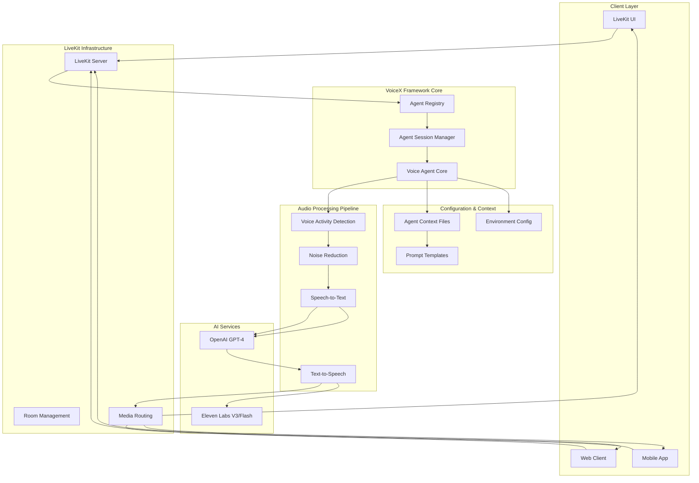

## Component Details

### 1. Agent Core Layer

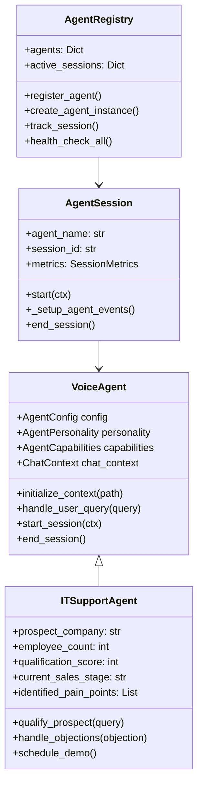

### 2. Audio Processing Pipeline

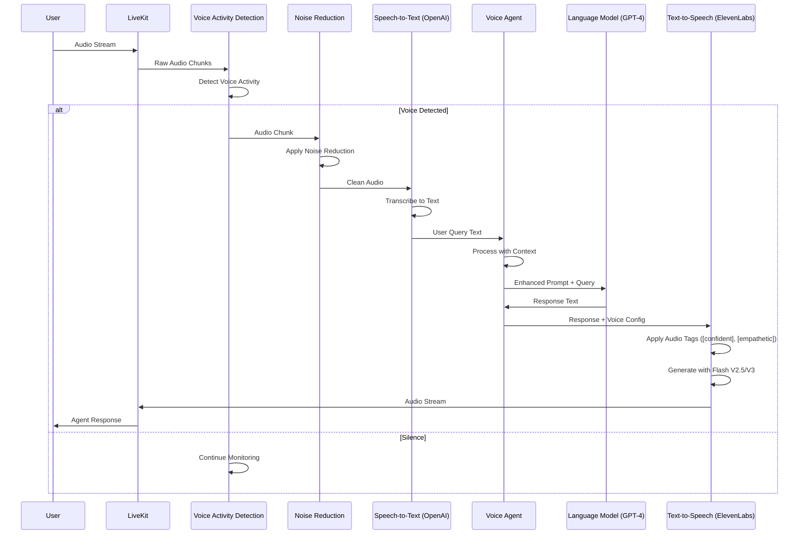

### 3. STT Layer Architecture

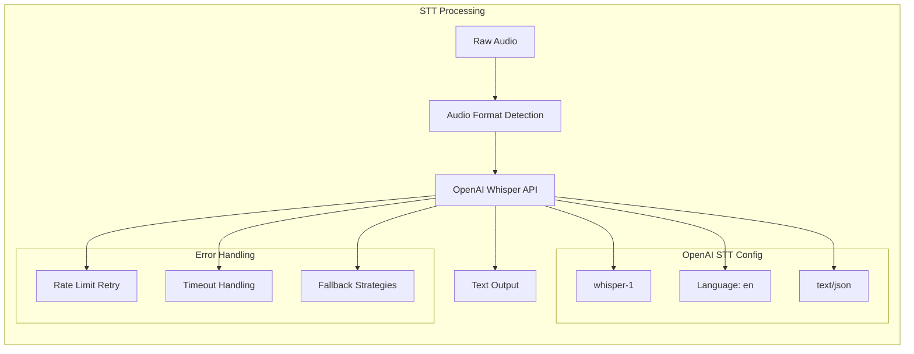

### 4. TTS Layer Architecture

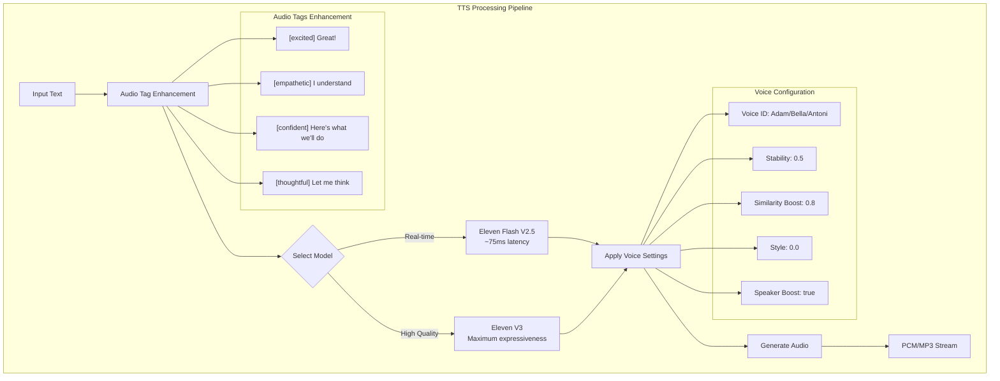

### 5. LLM Layer Architecture

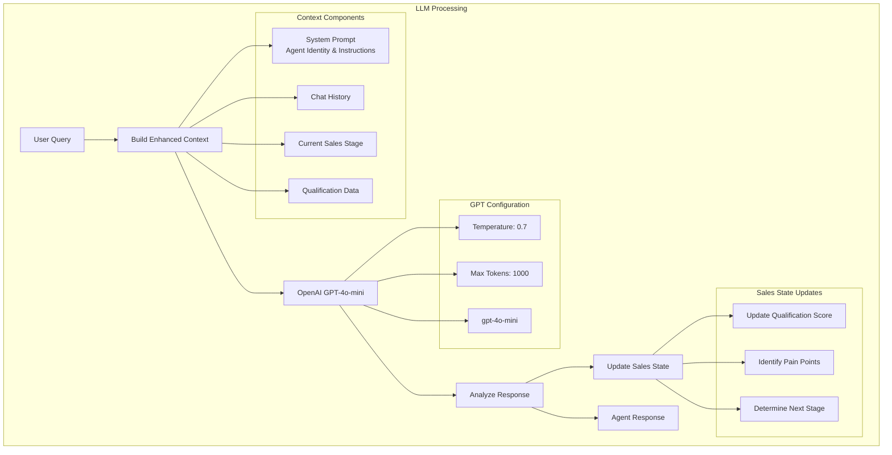

## Prompting Strategy Architecture

### 1. System Prompt Structure

```mermaid
graph TD
    subgraph "System Prompt Components"
        Identity[Agent Identity<br/>Sarah Mitchell, BDR at Swyt Solutions]
        Company[Company Mission<br/>IT Outsourcing, 40% Cost Reduction]
        Personality[Personality Traits<br/>Professional, Consultative, Results-oriented]
        
        subgraph "Sales Framework"
            Goals[Core Objectives<br/>Qualify prospects, Schedule demos]
            Flow[Conversation Flow<br/>Opening → Qualifying → Closing]
            Objections[Objection Handling<br/>Structured responses]
        end
        
        subgraph "Behavioral Guidelines"
            Questions[Question Strategy<br/>One at a time, consultative]
            Language[Professional Language<br/>Business value focused]
            Disqualification[Disqualification Criteria<br/>Clear exit conditions]
        end
        
        Identity --> Company
        Company --> Personality
        Personality --> Goals
        Goals --> Flow
        Flow --> Objections
        Objections --> Questions
        Questions --> Language
        Language --> Disqualification
    end
```

### 2. Context Enhancement Flow

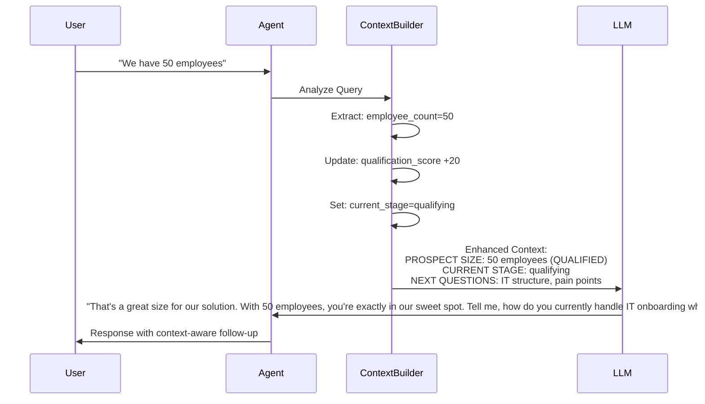

## Data Flow Architecture

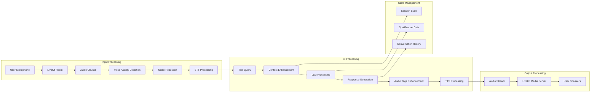

## Configuration Architecture

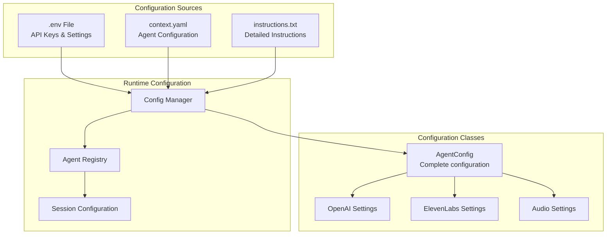

## Performance & Scalability

### Latency Optimization

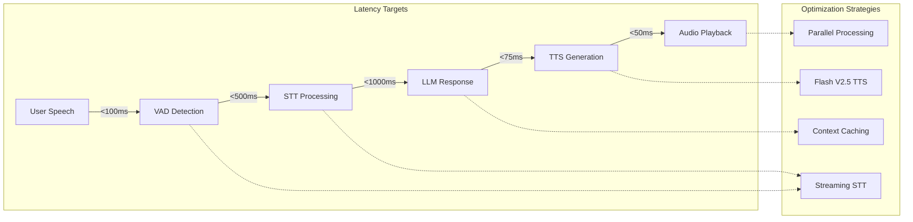

### Scalability Architecture

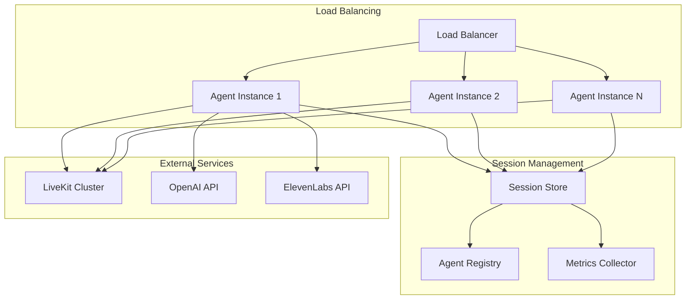

## Security Architecture

```mermaid
graph TB
    subgraph "API Security"
        APIKeys[Encrypted API Keys]
        RateLimit[Rate Limiting]
        TokenValidation[Token Validation]
    end
    
    subgraph "Data Security"
        AudioEncryption[Audio Stream Encryption]
        ConversationEncryption[Conversation Encryption]
        PIIScrubbing[PII Scrubbing]
    end
    
    subgraph "Access Control"
        Authentication[Authentication]
        Authorization[Authorization]
        SessionValidation[Session Validation]
    end
    
    subgraph "Monitoring"
        SecurityLogs[Security Logging]
        AuditTrails[Audit Trails]
        ThreatDetection[Threat Detection]
    end
    
    APIKeys --> RateLimit
    RateLimit --> TokenValidation
    
    AudioEncryption --> ConversationEncryption
    ConversationEncryption --> PIIScrubbing
    
    Authentication --> Authorization
    Authorization --> SessionValidation
    
    SecurityLogs --> AuditTrails
    AuditTrails --> ThreatDetection
```

This architecture ensures high performance, scalability, and security while maintaining the flexibility to add new agents and capabilities to the VoiceX Framework.
