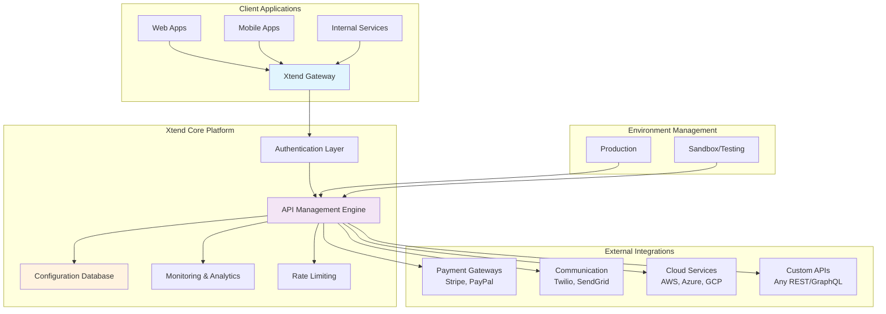
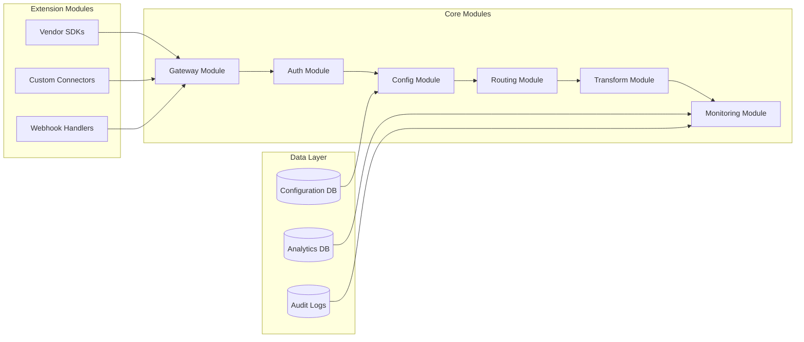
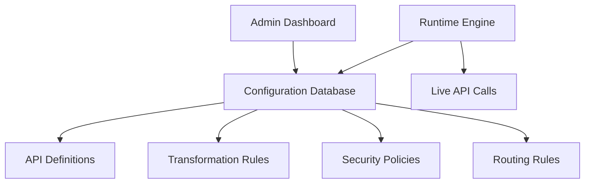
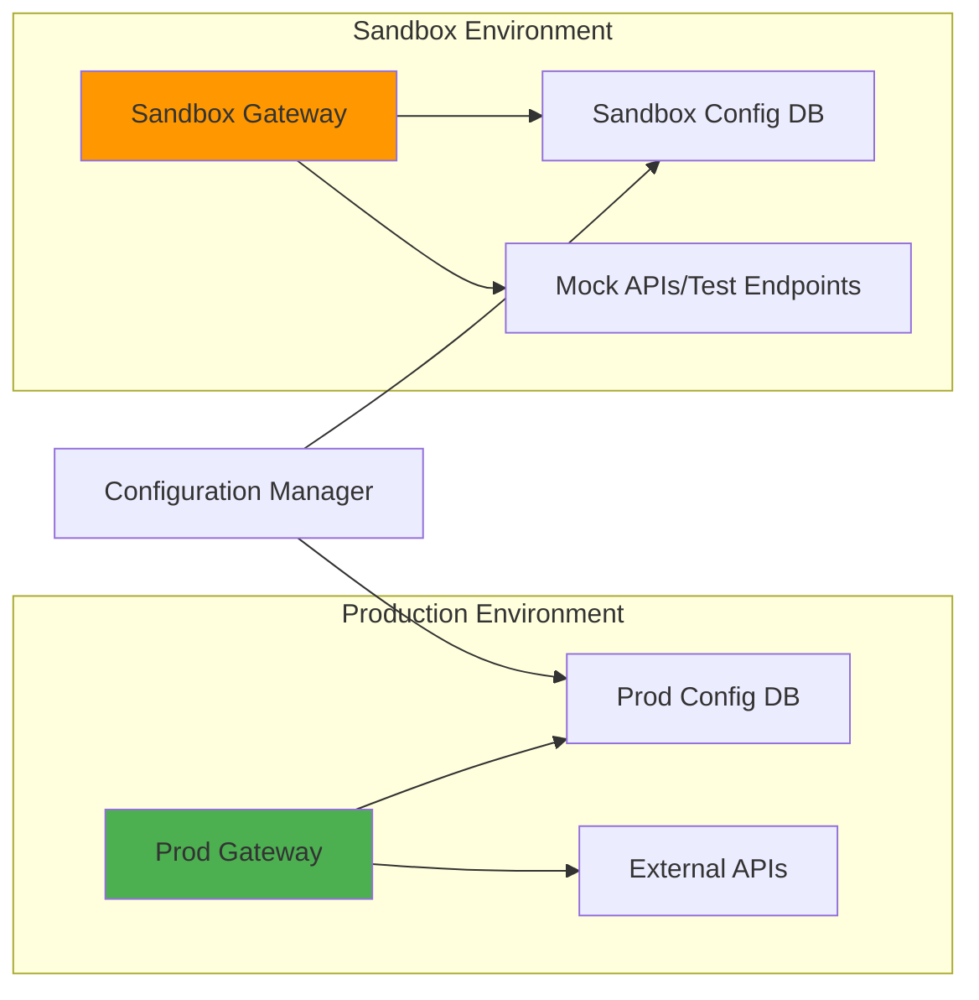
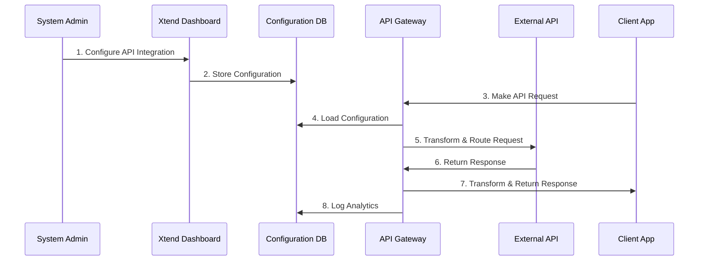
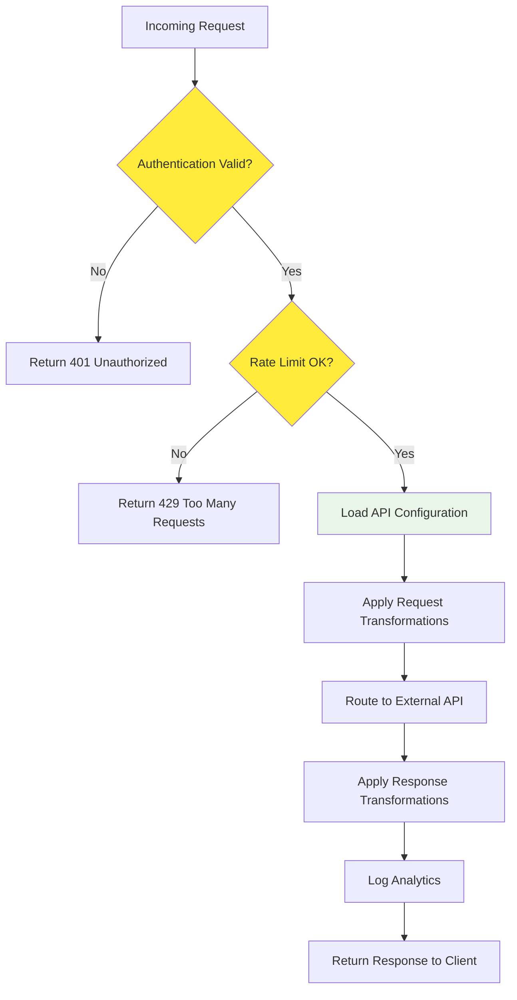
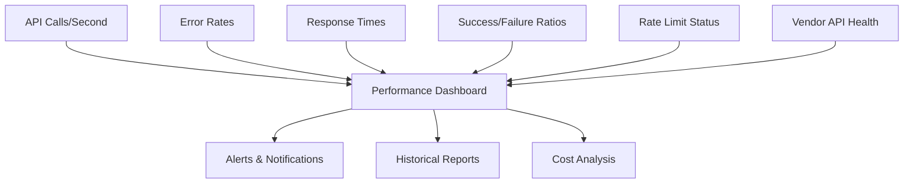
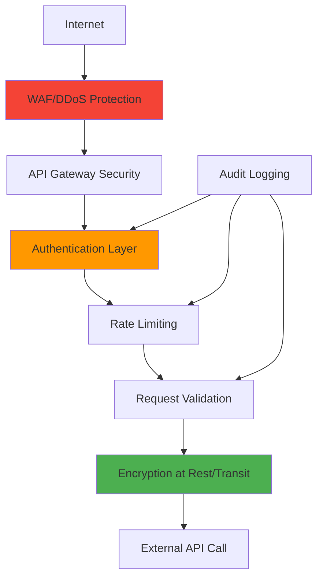
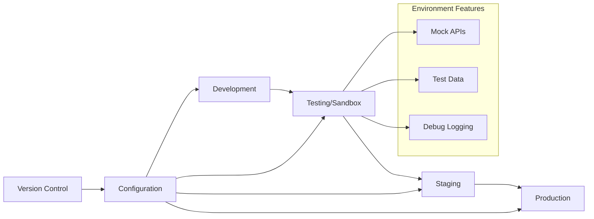

# Xtend - Enterprise API Management System

> **Transform your external API integrations with zero-code deployment, enterprise-grade security, and seamless vendor management.**

##  Overview

Xtend is a comprehensive Enterprise API Management System designed to streamline the integration of external APIs and vendor SDKs. Built with a modular, database-configurable architecture, Xtend enables organizations to manage complex API ecosystems without writing code.

### Key Benefits

-   **No-Code Deployment**: Deploy integrations through intuitive configuration
-   **Enterprise Security**: Production-ready with comprehensive audit trails
-   **Vendor Agnostic**: Support for any REST API or SDK integration
-   **Cost Optimization**: Reduce integration development time by 80%
-   **Scalable Architecture**: Handle thousands of concurrent API calls

----------

##  System Architecture

### High-Level Architecture Flow



### Modular Component Architecture



----------

##  Core Features

### 1. **No-Code Configuration Dashboard**

-   Visual API endpoint mapping
-   Drag-and-drop transformation rules
-   Real-time testing environment
-   Configuration version control

### 2. **Database-Driven Architecture**



### 3. **Environment Segregation**



----------

##  Technical Specifications

### **Stateless Architecture Benefits**

-   **Horizontal Scaling**: Add servers without complex configuration
-   **High Availability**: No single point of failure
-   **Cloud Native**: Deploy on any container orchestration platform
-   **Disaster Recovery**: Instant failover capabilities

### **Supported Integration Types**

Integration Type

Examples

Configuration Method

**Payment Gateways**

Stripe, PayPal, Square

SDK Wrapper + Config

**Communication**

Twilio, SendGrid, Slack

REST API + Transform Rules

**Cloud Services**

AWS S3, Azure Blob, GCP

SDK Integration

**CRM Systems**

Salesforce, HubSpot

REST API + OAuth

**Custom APIs**

Any REST/GraphQL

Manual Configuration

----------

## API Management Workflow

### Integration Lifecycle



### Request Processing Flow



----------

## Configuration Examples

### **Simple API Proxy Configuration**

```yaml
api_endpoints:
  - name: "payment_processor"
    path: "/api/v1/payments"
    method: "POST"
    target_url: "https://api.stripe.com/v1/charges"
    headers:
      - Authorization: "Bearer ${STRIPE_API_KEY}"
    transformations:
      request:
        - map: "amount_cents" to "amount"
        - map: "currency_code" to "currency"
    environment: "production"

```

### **Complex Multi-Step Integration**

```yaml
workflows:
  - name: "order_processing"
    steps:
      - call: "inventory_check"
        endpoint: "/api/inventory/check"
      - call: "payment_process"
        endpoint: "/api/payments/charge"
        condition: "inventory.available == true"
      - call: "notification_send"
        endpoint: "/api/notifications/send"
        condition: "payment.status == 'success'"

```

----------

## 🚦 Getting Started

### For Business Users

1.  **Access Dashboard**: Log into the Xtend management portal
2.  **Select Integration**: Choose from pre-built vendor integrations
3.  **Configure Settings**: Enter API keys and customize mappings
4.  **Test Integration**: Use sandbox environment for validation
5.  **Deploy to Production**: One-click deployment with rollback capability

### For Technical Teams

1.  **Environment Setup**: Configure production and sandbox environments
2.  **Security Configuration**: Set up authentication and rate limiting
3.  **Monitoring Setup**: Configure alerts and analytics dashboards
4.  **Custom Extensions**: Develop custom connectors if needed

----------

## Monitoring & Analytics

### Real-Time Dashboard Metrics



### Key Performance Indicators (KPIs)

-   **API Availability**: 99.9% uptime SLA
-   **Response Time**: < 200ms average latency
-   **Throughput**: 10,000+ requests per second
-   **Error Rate**: < 0.1% failure rate

----------

## 🔐 Security Features

### Multi-Layer Security Architecture



### Security Compliance

-   **SOC 2 Type II** compliant
-   **GDPR** data protection ready
-   **PCI DSS** for payment processing
-   **HIPAA** for healthcare integrations

----------

##  Environment Management

### Development Lifecycle



----------
